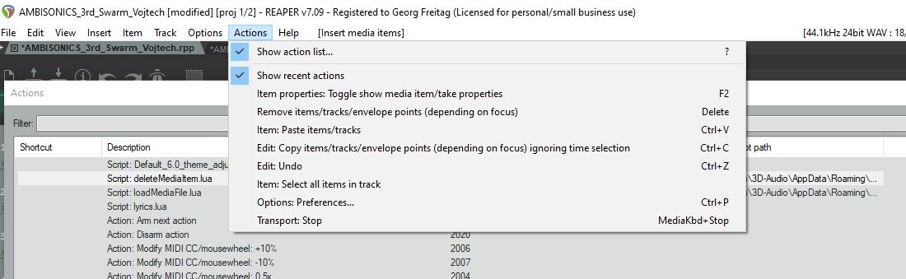
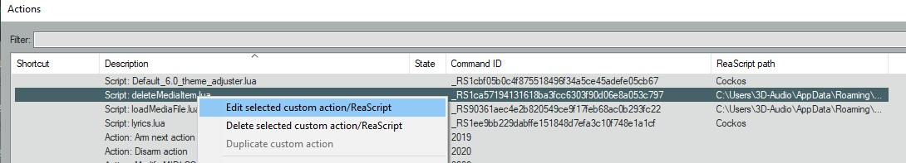
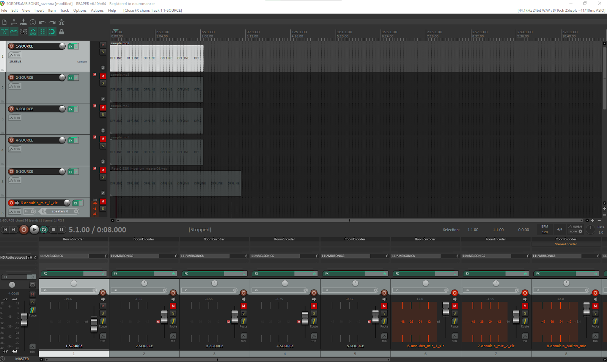
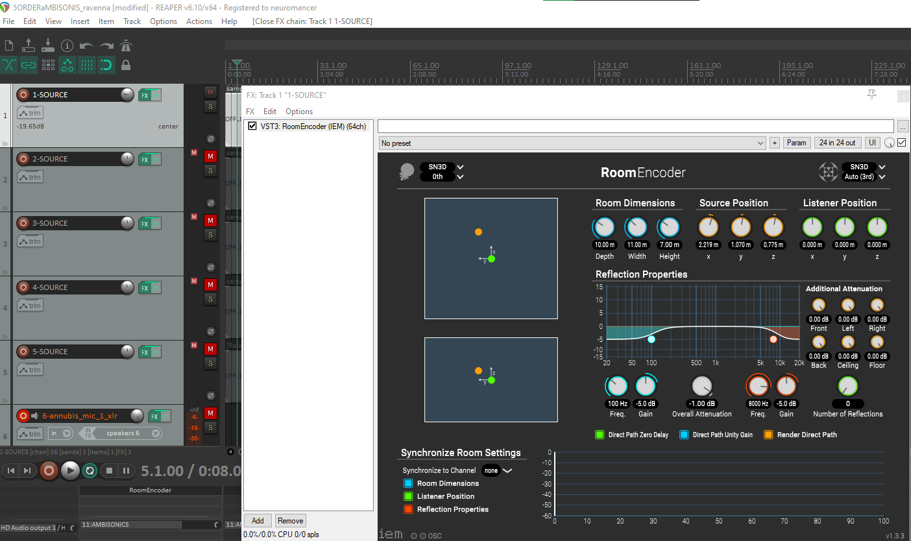
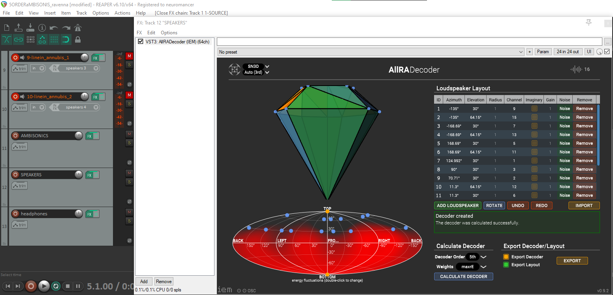
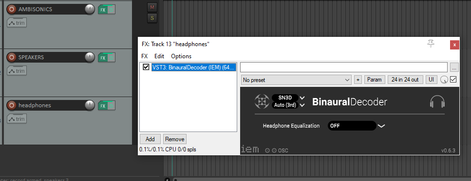
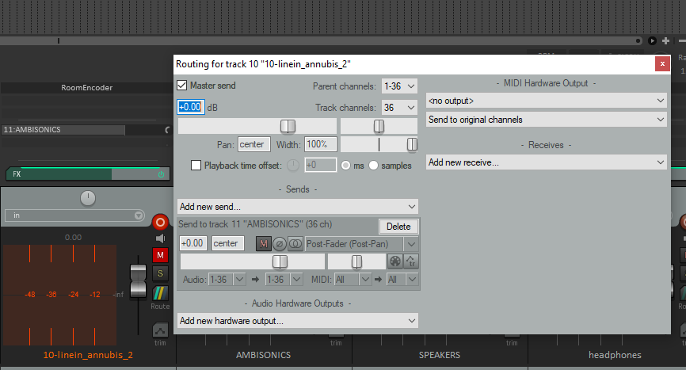
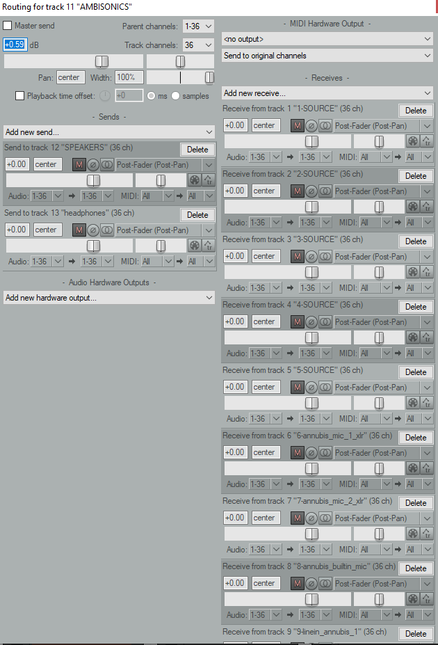

# Reaper DAW Automation
Automation scripts and OSC commands for Reaper DAW. Originally developed for Dresden SyncID Spatial audio container.

## Introduction
You can control spatial audio inside HTW container lan either manually by directly controlling Reaper DAW with mouse and keyboard OR you can do that programmatically with Open Sound Protocol (OSC for short). OSC is widely used in the audio industry and its successor to MIDI protocol. OSC ought to be more universal and offer more precision. 

When conducting experiments inside the container you may want to have interactive control of spatial audio or change audio sources positions via algorithms. Video rendering and light control can be done with other software but you might want to keep in sync with audio. To achieve that you can send OSC commands from software of your choice to spatial audio setup. Below you will find examples on how to do that. OSC is available as libraries or plugins for many software solutions.

In computer game development it is common to have separate engines for the game and the audio. We are using the same concept. This allows musicians to use all the tools available for DAWs and do not limit the interactive control. It also allows to separate the audio processing development and interactivity development.

## Turning it on
1. Turn on all speakers
2. Turn on Hapi
3. Turn on Anubis
4. Turn on PC
5. Open Reaper DAW project (in documents folder find folder called reaper - inside double click the project)
6. Make sure the tracks you want to use are not muted and ones you don’t are muted
7. Press play button if needed (not necessary for microphone / line inputs)

## Video overview of the Reaper DAW
https://youtu.be/dGiwkbu3KS0

## Java OSC commands
### Introduction
Even though the examples below are written in Java you should have no problem adapting them to your chosen programming language. 
First you need to start OSC server and client:
```
oscP5 = new OscP5(this, 12000); //listen on port 12000 for incoming messages fromReaper DAW - optional, not necessary but useful for getting status back
myRemoteLocation = new NetAddress("127.0.0.1", 8000); //define the IP and port where you will send OSC commands
```
See general function description:
```
Void nameOfTheFuntion( typeOfVariable variableName, typeOfVariable variableName){
//note that osc message is always constructed from pattern name (text string) + value or values
//declare variable type osc message with given text pattern
OscMessage myMessage = new OscMessage("/pattern"); 
myMessage.add(variableName); //add some value into the message - order matters!
oscP5.send(myMessage, myRemoteLocation); //send message to Reaper DAW
}
```
#### Included examples
* dynamically change audio source position for each audio source/track
* set listener position
* Adjust track volume
* adjust master volume
* control reaper play button
* control reaper stop button
* control reaper pause button
* trigger custom action (lua script)
* rename track

### Lua scripts
Certain actions can not be achieved with OSC - for example loading or deleting new files during runtime. This can be done with .lua scripts that Reaper can execute. We can call these scripts with OSC.
Lua scripts can be seen when you open Reaper and click Actions -> See Action list. New window will apear with all action avaliable. Look for lua scripts. You can edit existing scripts by right click -> edit selected action.
There is another problem with .lua script thought - they can not accept any paramteres when called with OSC. We solve this by first call OSC command to change the first track name. We change the name to arbitrary string that contains our parameters. The .lua script will look for the name of first track and parse it to retrieve the parameters. 


Show Actions menu

Right click to edit existing script

## DAW overview
Below you can see the Reaper DAW interface. On the left and also on the bottom you can find all tracks listed. Some tracks represent audio sources (stereo 1-SOURCE to  5-SOURCE), microphone or line inputs of Annubis (mono), general AMBISONICS track and outputs - speakers and headphones track.

All sources are first converted from stereo or mono into 36 spatial audio and sent to ambisonics track. From ambisonics track the audio is rendered into speakers track with aiira decoder and also into headphone track as binaural stereo. 



Screenshot of Reaper interface 1



IEM VST Room Encoder - Stereo and mono sources are converted into 36 channel ambisonics with spatial audio VST called Room encoder - this is what you can adjust to change source or listener position.



From ambisonics track audio is rendered into speakers with aiira VST decoder. Decoder is set to reflect physical speakers position and cabling order.



From ambisonics track audio is rendered into headphones with binaural VST decoder.



Each source is routed into an ambisonic track…



Ambisonics track includes all audio sources…

## Troubleshoot
Please have a look at the video [overview of the DAW Reaper setup](https://youtu.be/dGiwkbu3KS0) and read this documentation first. If it does not solve your problem, you can create a new issue here, but you are also encouraged to contribute.
